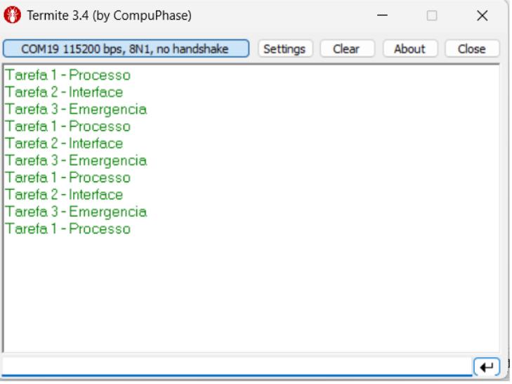
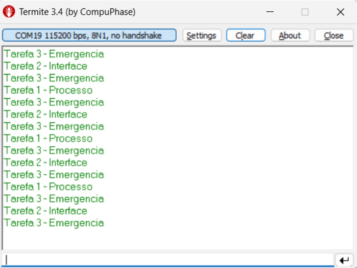
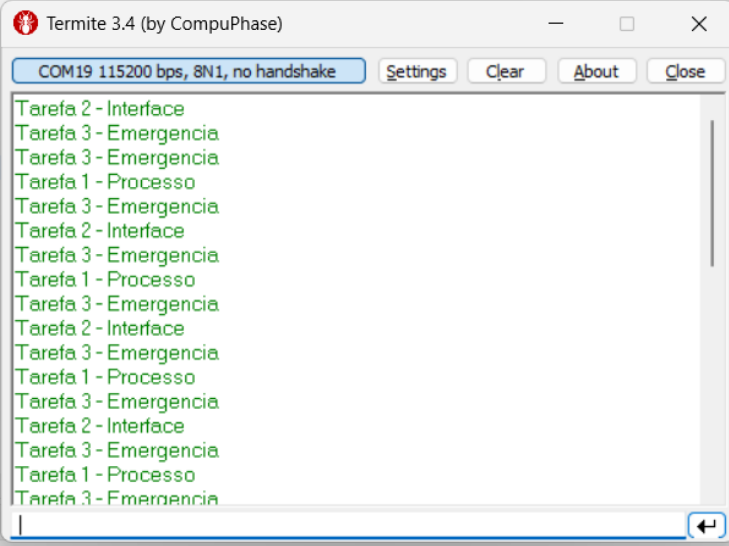
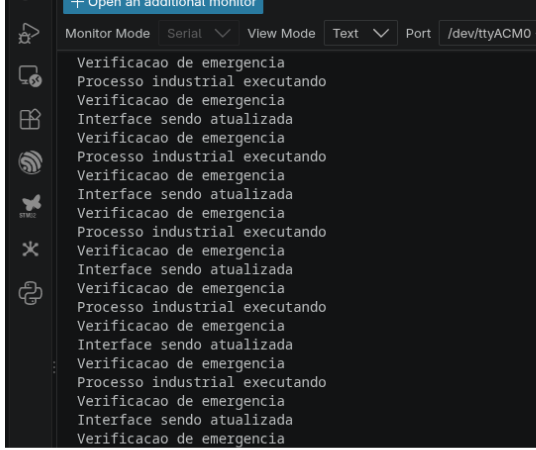
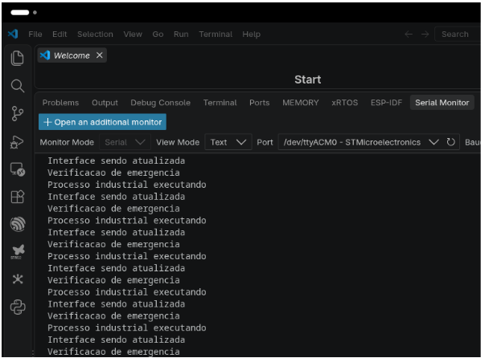
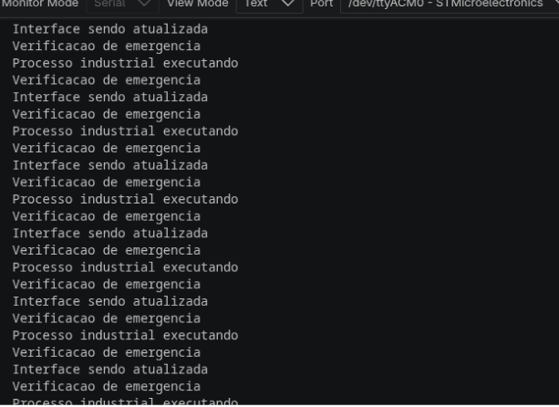
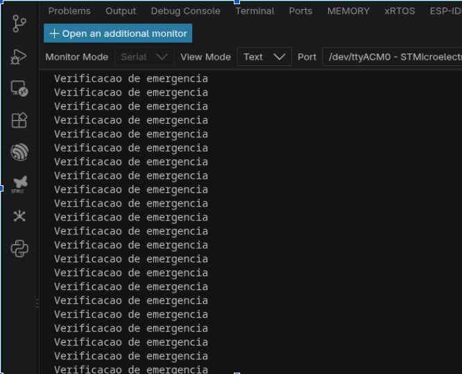

# Lista 2 - Prioridades, Semáforos e Mutex

Relatório de resolução das atividades práticas do curso **FreeRTOS e CMSIS-RTOS v2**, utilizando a placa **STM32 Nucleo-F767ZI**.

| Informação | Dados |
| --- | --- |
| Programa | Virtus-CC - Capacitação em Sistemas Embarcados |
| Estudantes | Vinicius Batista Duarte e Isabelle Lavínia |
| Instrutor | Moacy Pereira da Silva |
| Data da submissão | 17/09/2026 |
| API utilizada | CMSIS-RTOS v2 sobre FreeRTOS |

## Sumário

- [Conceitos utilizados](#conceitos-utilizados)
- [Atividade 1 - Quem deve executar primeiro?](#atividade-1---quem-deve-executar-primeiro)
- [Atividade 2 - Atendimento de uma situação crítica](#atividade-2---atendimento-de-uma-situação-crítica)
- [Atividade 3 - Só processe quando houver dados](#atividade-3---só-processe-quando-houver-dados)
- [Atividade 4 - Recursos limitados](#atividade-4---recursos-limitados)
- [Atividade 5 - Compartilhamento da UART](#atividade-5---compartilhamento-da-uart)
- [Atividade 6 - O contador que apresenta o valor errado](#atividade-6---o-contador-que-apresenta-o-valor-errado)
- [Atividade 7 - Se estiver ocupado, faça outra coisa](#atividade-7---se-estiver-ocupado-faça-outra-coisa)
- [Atividade 8 - Mini Sistema Industrial](#atividade-8---mini-sistema-industrial)
- [Síntese](#síntese)

## Conceitos utilizados

| Mecanismo | Pergunta que ajuda a identificar sua utilização |
| --- | --- |
| Prioridade | Qual tarefa pronta deve receber a CPU primeiro? |
| Semáforo | Quando uma tarefa deve ser autorizada a continuar ou quantos recursos estão disponíveis? |
| Mutex | Qual tarefa possui, neste momento, um recurso compartilhado? |

## Atividade 1 - Quem deve executar primeiro?

### Objetivo

Investigar o efeito das prioridades e do bloqueio voluntário no escalonamento.

### Diagrama

```text
[TaskSensor]       \
[TaskDisplay]       +--> [UART3 / Terminal Serial]
[TaskDiagnostico]  /
```

### Código principal

```c
#include "main.h"
#include "cmsis_os2.h"
#include <string.h>

extern UART_HandleTypeDef huart3;

static const osThreadAttr_t sensor_attributes = {
	.name = "TaskSensor", .priority = osPriorityNormal, .stack_size = 512
};
static const osThreadAttr_t display_attributes = {
	.name = "TaskDisplay", .priority = osPriorityNormal, .stack_size = 512
};
static const osThreadAttr_t diagnostico_attributes = {
	.name = "TaskDiagnostico", .priority = osPriorityNormal, .stack_size = 512
};

static void TaskSensor(void *argument);
static void TaskDisplay(void *argument);
static void TaskDiagnostico(void *argument);

void MX_FREERTOS_Init(void)
{
	osThreadNew(TaskSensor, NULL, &sensor_attributes);
	osThreadNew(TaskDisplay, NULL, &display_attributes);
	osThreadNew(TaskDiagnostico, NULL, &diagnostico_attributes);
}

static void TaskSensor(void *argument)
{
	const char message[] = "TaskSensor executando\r\n";
	for (;;) {
		HAL_UART_Transmit(&huart3, (uint8_t *)message, strlen(message), HAL_MAX_DELAY);
		osDelay(500);
	}
}

static void TaskDisplay(void *argument)
{
	const char message[] = "TaskDisplay executando\r\n";
	for (;;) {
		HAL_UART_Transmit(&huart3, (uint8_t *)message, strlen(message), HAL_MAX_DELAY);
		osDelay(500);
	}
}

static void TaskDiagnostico(void *argument)
{
	const char message[] = "TaskDiagnostico executando\r\n";
	for (;;) {
		HAL_UART_Transmit(&huart3, (uint8_t *)message, strlen(message), HAL_MAX_DELAY);
		osDelay(500);
	}
}
```

### Experimentos e evidências

#### Experimento A - Prioridades iguais

As três tarefas utilizaram `osPriorityNormal` e `osDelay(500)`. Como todas ficam prontas em condições semelhantes, o escalonador alterna a execução entre elas.



#### Experimento B - Prioridades diferentes

As prioridades foram configuradas como `osPriorityHigh` para `TaskSensor`, `osPriorityNormal` para `TaskDisplay` e `osPriorityLow` para `TaskDiagnostico`. A tarefa de maior prioridade tem preferência quando está no estado `Ready`, mas libera a CPU durante `osDelay()`.



#### Experimento C - Bloqueio voluntário

Foram testados atrasos diferentes, como 100 ms, 500 ms e 1000 ms. A frequência com que cada tarefa retorna ao estado `Ready` muda conforme o atraso.



### Análise

Aumentar a prioridade não significa necessariamente que uma tarefa executará mais vezes. A prioridade apenas determina qual tarefa em estado `Ready` terá preferência pela CPU. Se a tarefa estiver `Blocked`, por exemplo durante um `osDelay()`, ela não poderá executar, mesmo sendo de alta prioridade. Portanto, a frequência depende da prioridade, do tempo de execução e dos períodos em que a tarefa fica `Running`, `Ready` ou `Blocked`.

## Atividade 2 - Atendimento de uma situação crítica

### Objetivo

Compreender como diferenciar tarefas críticas e não críticas usando prioridades.

### Diagrama

```text
[TaskProcesso]   \
[TaskInterface]    +--> [Escalonador FreeRTOS] --> [CPU]
[TaskEmergencia] /
```

### Código principal

```c
#include "cmsis_os2.h"

static const osThreadAttr_t processo_attributes = {
	.name = "TaskProcesso", .priority = osPriorityNormal, .stack_size = 512
};
static const osThreadAttr_t interface_attributes = {
	.name = "TaskInterface", .priority = osPriorityNormal, .stack_size = 512
};

/* Alterar entre osPriorityLow, osPriorityNormal e osPriorityHigh. */
static const osThreadAttr_t emergencia_attributes = {
	.name = "TaskEmergencia", .priority = osPriorityHigh, .stack_size = 512
};

void MX_FREERTOS_Init(void)
{
	osThreadNew(TaskProcesso, NULL, &processo_attributes);
	osThreadNew(TaskInterface, NULL, &interface_attributes);
	osThreadNew(TaskEmergencia, NULL, &emergencia_attributes);
}

void TaskProcesso(void *argument)
{
	for (;;) {
		printf("Processo industrial executando\r\n");
		osDelay(200);
	}
}

void TaskInterface(void *argument)
{
	for (;;) {
		printf("Interface sendo atualizada\r\n");
		osDelay(500);
	}
}

void TaskEmergencia(void *argument)
{
	for (;;) {
		printf("Verificacao de emergencia\r\n");
		osDelay(100);
	}
}
```

### Experimentos e evidências

| Experimento | Configuração | Comportamento observado |
| --- | --- | --- |
| A | Emergência com prioridade baixa | Aguarda as tarefas normais deixarem de estar prontas. |
| B | Emergência com prioridade normal | Compete em igualdade com as demais tarefas normais. |
| C | Emergência com prioridade alta | Preempta as tarefas normais assim que fica pronta. |
| Desafio | Tarefa de menor importância usando intensivamente a CPU | Pode prejudicar tarefas de menor prioridade; o efeito depende do escalonamento e da configuração. |






### Análise

Uma prioridade elevada não garante, sozinha, um pequeno tempo de resposta. A tarefa ainda pode estar bloqueada, pode esperar um mutex, sofrer atraso causado por seções críticas ou ser atrasada por interrupções. Também pode ocorrer inversão de prioridade quando uma tarefa de alta prioridade depende de um recurso retido por uma tarefa de baixa prioridade. O mutex com herança de prioridade ajuda a limitar esse problema.

## Atividade 3 - Só processe quando houver dados

### Objetivo e diagrama

Sincronizar a produção e o processamento de dados com um semáforo binário.

```text
[TaskSensor] --osSemaphoreRelease--> [Semáforo binário]
										   |
										   +--osSemaphoreAcquire--> [TaskProcessamento]
```

### Implementação

```c
osSemaphoreId_t sensorSemHandle;

void TaskSensor(void *argument)
{
	for (;;) {
		osDelay(1000);
		printf("Sensor: novo dado coletado.\r\n");
		osSemaphoreRelease(sensorSemHandle);
	}
}

void TaskProcessamento(void *argument)
{
	for (;;) {
		osSemaphoreAcquire(sensorSemHandle, osWaitForever);
		printf("Processamento: dado processado com sucesso.\r\n");
	}
}
```

### Análise

No polling, a tarefa verifica continuamente uma flag e consome CPU mesmo quando não há dados. Com o semáforo, ela permanece em `Blocked` até o sensor sinalizar um novo dado. Assim, a solução com semáforo utiliza melhor a CPU e também reduz o consumo de energia.

**Evidência:** captura do terminal comparando polling e semáforo será adicionada posteriormente.

## Atividade 4 - Recursos limitados

### Objetivo e diagrama

Representar três vagas de estacionamento com um semáforo contador.

```text
[Carro1..Carro5] --acquire--> [Semáforo contador]
									 capacidade: 3, 2 ou 1
[Carro1..Carro5] <--release-- [Vagas disponíveis]
```

### Implementação

```c
osSemaphoreId_t vagasHandle;

void TaskCarro(void *argument)
{
	const char *nome = (const char *)argument;
	for (;;) {
		printf("%s: tentando entrar...\r\n", nome);
		osSemaphoreAcquire(vagasHandle, osWaitForever);
		printf("%s: entrada autorizada. Estacionado.\r\n", nome);
		osDelay(2000);
		printf("%s: saindo do estacionamento.\r\n", nome);
		osSemaphoreRelease(vagasHandle);
		osDelay(1000);
	}
}
```

### Análise

Somente o número de tarefas correspondente à contagem do semáforo entra simultaneamente. Quando a contagem é reduzida de 3 para 2 e depois para 1, mais tarefas permanecem bloqueadas aguardando uma vaga.

Um semáforo contador com valor 1 permite apenas um usuário por vez, mas não é equivalente a um mutex. O semáforo não possui propriedade: qualquer tarefa pode liberá-lo. O mutex possui ownership, deve ser liberado pelo seu proprietário e pode oferecer herança de prioridade.

**Evidência:** captura do acesso das cinco tarefas às vagas será adicionada posteriormente.

## Atividade 5 - Compartilhamento da UART

### Objetivo e diagrama

Proteger a UART contra acessos concorrentes de duas tarefas.

```text
[TaskSensor]   \
				 +--> [uartMutexHandle] --> [Região crítica: UART]
[TaskControle] /
```

### Implementação

```c
osMutexId_t uartMutexHandle;

static void imprimirSensor(void)
{
	for (int i = 0; i < 50; i++) printf("SENSOR...");
	printf("\r\n");
}

static void imprimirControle(void)
{
	for (int i = 0; i < 50; i++) printf("CONTROLE...");
	printf("\r\n");
}

void TaskSensor(void *argument)
{
	for (;;) {
		osMutexAcquire(uartMutexHandle, osWaitForever);
		imprimirSensor();
		osMutexRelease(uartMutexHandle);
		osDelay(10);
	}
}

void TaskControle(void *argument)
{
	for (;;) {
		osMutexAcquire(uartMutexHandle, osWaitForever);
		imprimirControle();
		osMutexRelease(uartMutexHandle);
		osDelay(10);
	}
}
```

### Análise

Sem proteção, as mensagens podem ser entrelaçadas e corrompidas. O mutex é mais adequado porque representa exclusão mútua e propriedade do recurso, além de poder usar herança de prioridade. Um semáforo seria apropriado para sinalização ou contagem, não para expressar a posse da UART.

**Evidência:** captura comparando a UART sem proteção e com mutex será adicionada posteriormente.

## Atividade 6 - O contador que apresenta o valor errado

### Objetivo e implementação

Demonstrar uma condição de corrida e corrigi-la com mutex.

```c
uint32_t contadorGlobal = 0;
osMutexId_t contadorMutexHandle;

void TaskIncremento(void *argument)
{
	for (int i = 0; i < 100000; i++) {
		osMutexAcquire(contadorMutexHandle, osWaitForever);
		contadorGlobal++;
		osMutexRelease(contadorMutexHandle);
	}
	osThreadExit();
}

void TaskPrint(void *argument)
{
	osDelay(2000);
	printf("Valor final do contador = %lu\r\n", contadorGlobal);
	osThreadExit();
}
```

### Análise

`contadorGlobal++` não precisa ser uma operação atômica. Ela pode ser entendida como:

```text
LER -> MODIFICAR -> ESCREVER
```

Se duas tarefas lerem o mesmo valor antes de qualquer uma escrever o resultado, ambas calcularão o mesmo próximo valor e uma atualização será perdida. Sem mutex, o valor pode ficar abaixo de 200000. Com o mutex protegendo cada incremento, o valor esperado é obtido de forma consistente.

**Evidência:** captura dos valores inconsistente e corrigido será adicionada posteriormente.

## Atividade 7 - Se estiver ocupado, faça outra coisa

### Objetivo e implementação

Comparar espera indefinida, timeout limitado e tentativa sem espera.

```c
osMutexId_t recursoMutexHandle;

void TaskControle(void *argument)
{
	for (;;) {
		if (osMutexAcquire(recursoMutexHandle, 0) == osOK) {
			printf("Recurso adquirido; executando região crítica.\r\n");
			osDelay(100);
			osMutexRelease(recursoMutexHandle);
		} else {
			printf("Recurso ocupado; executando atividade alternativa.\r\n");
		}
		osDelay(200);
	}
}
```

### Análise

- `osWaitForever`: a tarefa fica bloqueada até o recurso ser liberado.
- Timeout limitado: a tarefa aguarda por um período e segue outro fluxo se não conseguir o recurso.
- Timeout igual a zero: a tentativa é imediata e a tarefa executa uma atividade alternativa em caso de falha.

Em controle em tempo real, bloquear indefinidamente por um recurso não essencial pode impedir a execução de rotinas mais importantes, aumentar a latência e comprometer o determinismo do sistema.

**Evidência:** comparação dos três tipos de timeout será adicionada posteriormente.

## Atividade 8 - Mini Sistema Industrial

### Objetivo e arquitetura

Integrar prioridades, semáforo binário, mutex UART e timeout limitado em uma esteira industrial.

```text
[TaskSensor] --semáforo binário--> [TaskProcessamento: Alta]
									  |
									  +--> [TaskSupervisao: Normal]
									  +--> [TaskLog: Baixa]
									  +--> [TaskAlarme: Alta]

[TaskProcessamento, TaskSupervisao, TaskLog, TaskAlarme]
						 |
						 +--> [Mutex UART] --> [UART]
```

### Implementação resumida

```c
osSemaphoreId_t semPecaHandle;
osMutexId_t uartMutexHandle;

void TaskSensor(void *argument)
{
	for (;;) {
		osDelay(1500);
		osSemaphoreRelease(semPecaHandle);
	}
}

void TaskProcessamento(void *argument)
{
	for (;;) {
		osSemaphoreAcquire(semPecaHandle, osWaitForever);
		osMutexAcquire(uartMutexHandle, osWaitForever);
		printf("[PROCESSAMENTO] Peça processada.\r\n");
		osMutexRelease(uartMutexHandle);
	}
}

void TaskSupervisao(void *argument)
{
	for (;;) {
		osMutexAcquire(uartMutexHandle, osWaitForever);
		printf("[SUPERVISAO] Esteira OK.\r\n");
		osMutexRelease(uartMutexHandle);
		osDelay(500);
	}
}

void TaskLog(void *argument)
{
	for (;;) {
		if (osMutexAcquire(uartMutexHandle, 100) == osOK) {
			printf("[LOG] Evento gravado.\r\n");
			osMutexRelease(uartMutexHandle);
		}
		osDelay(1000);
	}
}

void TaskAlarme(void *argument)
{
	for (;;) {
		/* Verificação de alarme deve ser rápida e não bloquear indefinidamente. */
		osDelay(50);
	}
}
```

### Matriz de requisitos

| Requisito | Mecanismo | Justificativa |
| --- | --- | --- |
| Atendimento crítico e alarmes | Prioridade alta | Permite preempção sobre tarefas operacionais. |
| Sinalização sensor-processamento | Semáforo binário | Libera o processamento somente quando há uma peça. |
| Proteção da UART | Mutex com herança de prioridade | Evita mensagens corrompidas e limita inversão de prioridade. |
| Registro não bloqueante | Mutex com timeout limitado | Permite desistir ou postergar o log quando a UART está ocupada. |
| Supervisão periódica | `osDelay` + mutex | Mantém a tarefa ativa sem monopolizar a CPU. |

### Análise

O sensor sinaliza a chegada de uma peça, o processamento recebe prioridade alta e a UART é protegida por mutex. A supervisão executa periodicamente, enquanto o log pode desistir da UART após um timeout. A tarefa de alarme deve ter prioridade adequada e não esperar indefinidamente por recursos de comunicação.

**Evidência:** captura da integração das tarefas será adicionada posteriormente.

## Síntese

| Problema | Prioridade | Semáforo | Mutex |
| --- | :---: | :---: | :---: |
| Definir qual tarefa deve executar primeiro | X |  |  |
| Esperar pela ocorrência de um evento |  | X |  |
| Proteger uma variável compartilhada |  |  | X |
| Controlar acesso exclusivo à UART |  |  | X |
| Representar três recursos disponíveis |  | X |  |
| Atender rapidamente uma tarefa crítica | X |  |  |
| Sincronizar sensor e processamento |  | X |  |

### Diferenças conceituais e exemplos

1. **Prioridade:** define qual tarefa pronta recebe preferência da CPU. Exemplo: uma rotina de parada de emergência acima da atualização de uma tela.
2. **Semáforo:** sinaliza eventos ou representa uma quantidade de recursos disponíveis. Exemplo: uma interrupção do ADC sinalizando que um buffer foi preenchido.
3. **Mutex:** protege um recurso compartilhado com ownership. Exemplo: controlar o acesso de várias tarefas ao mesmo barramento I2C.

### Critério de decisão

- Altere a **prioridade** quando o problema for latência ou preferência de execução.
- Use um **semáforo** quando a execução depender de um evento ou da disponibilidade de recursos.
- Use um **mutex** quando tarefas compartilharem uma variável, periférico ou estrutura e apenas uma puder utilizá-la por vez.